# 🚀 PracterViews: The Future of AI Interviewing  

   


> **“The most advanced, resilient, and immersive interview simulation platform ever built.”**

PracterViews is not just an AI interviewer — it's a **hyper-realistic simulation engine**.  
Powered by multimodal LLMs, cinematic avatars, and real-time audio/video orchestration, it recreates the feeling of interviewing with a real human in milliseconds.

---

# 🌌 Architecture of Intelligence

Every frame, every breath, every audio packet — orchestrated in parallel through a neural workflow that feels alive.

```mermaid
graph TD
    %% Node Styles
    classDef user fill:#ff4b4b,stroke:#333,stroke-width:2px,color:white,font-weight:bold;
    classDef frontend fill:#2d3748,stroke:#63b3ed,stroke-width:1px,color:white;
    classDef backend fill:#2d3748,stroke:#9f7aea,stroke-width:1px,color:white;
    classDef ai fill:#2d3748,stroke:#f6e05e,stroke-width:1px,color:white;
    classDef cloud fill:#2d3748,stroke:#48bb78,stroke-width:1px,color:white;

    User([👤 CANDIDATE])
    
    subgraph Cloud_Layer [☁️ GLOBAL REAL-TIME NETWORK]
        LK[⚡ LiveKit Edge Network]
    end

    subgraph Client_Layer [💻 IMMERSIVE FRONTEND]
        Dashboard[📱 Holo-Dashboard]
        Room[🎥 4K Interview Room]
        Visualizer[📊 Audio Visualizer]
    end
    
    subgraph Core_Layer [🧠 NEURAL BACKEND]
        Agent[🤖 Orchestrator Agent]
        TokenServer[🛡️ Sentinel Auth]
        
        subgraph AI_Cluster [✨ GENERATIVE ENGINES]
            Gemini[🧠 Gemini 2.0 Flash\nReasoning Core]
            
            subgraph Avatar_System [🎭 DYNAMIC AVATAR PIPELINE]
                Tavus[🗣️ TAVUS\nHigh-Fidelity Avatar]
                Bey[👻 BEYOND PRESENCE\nInstant Fallback Avatar]
            end
        end
    end

    %% Critical Paths
    User <==>|WebRTC Audio & Video| Room
    Room <==>|WebSocket Stream| LK
    LK <==>|Data Channels| Agent
    
    %% Logic Flow
    Agent <==>|Multimodal Context| Gemini
    Agent ==>|Render Stream| Tavus
    
    %% Fallback Logic
    Tavus -.->|❌ CRITICAL FAILURE| Bey
    Bey -.->|✅ AUTO-RECOVERY| Room
    
    %% Extra Visual Data Flow
    Room -.->|Audio Data| Visualizer

    %% Style Applications
    class User user
    class Dashboard,Room,Visualizer frontend
    class Agent,TokenServer backend
```



---

# 🛡️ Immortal Fallback System

This pipeline is engineered to **never die** — no downtime, no silent failures, no awkward avatar freeze.

### Primary Core — Tavus  
High-fidelity cinematic avatar generation for hyper-realistic interviews.

### Automatic Failover — Beyond Presence  
If Tavus hits rate limits, outages, or API errors, we instantly **hot-swap** to Beyond Presence.

### Dynamic Voice Shift  
When fallback triggers:

- Aoede (Female) → Puck (Male)  
- Voice morphs seamlessly  
- Avatar identity updates in real time  

The candidate never notices the switch.

---

# 🎨 Cinematic Frontend Experience

Built using **React 18 + Vite**, animated with **Framer Motion**, and styled using **Tailwind CSS**.

- Glassmorphism interface  
- Real-time background blur  
- Physics-based transitions  
- Live-reactive audio visualizers  
- Adaptive rendering for all devices  

---

# 🛠️ Tech Stack of Titans

| Component | Technology | Role |
|----------|------------|------|
| Core Brain | Python 3.10 | AsyncIO orchestration & agent logic |
| AI Model | Gemini 2.0 Flash | Multimodal reasoning (audio ↔ text ↔ video) |
| Real-time Transport | LiveKit | WebRTC media + data channels |
| Frontend | React + Vite | High-performance UI |
| Styling | Tailwind CSS | Utility-first design |
| Motion | Framer Motion | Cinematic transitions |
| Avatars | Tavus + Beyond Presence | Primary + fallback visual synthesis |

---

#  Deployment Protocol

## Phase 1 — Installation

### Frontend Setup
```bash
cd frontend
npm install
# Return to project root
cd ..
```

### Backend Setup
```bash
# Create virtual environment
python -m venv venv

# Activate (Windows)
.\venv\Scripts\Activate

# Activate (Mac/Linux)
# source venv/bin/activate

# Install dependencies
pip install -r requirements.txt
```

---

## Phase 2 — Environment Injection

Create a `.env` file:


```env
# LiveKit Cloud
LIVEKIT_URL=wss://your-project.livekit.cloud
LIVEKIT_API_KEY=sk_******
LIVEKIT_API_SECRET=******

# Google Gemini
GOOGLE_API_KEY=AIza****************

# Tavus Avatar
TAVUS_API_KEY=************************

# Beyond Presence Fallback
BEY_API_KEY=************************
BEY_AVATAR_ID=avatar_**************
```

---

## Phase 2 — System Ignition

### 1️⃣ Token Server (Gatekeeper)

```bash
python token_server.py
# ONLINE @ Port 3000
```

### 2️⃣ AI Agent (Brain)

```bash
python agent.py dev
# LISTENING for real-time streams
```

### 3️⃣ Frontend (Interface)

```bash
cd frontend
npm run dev
# Running @ http://localhost:5173
```

---

# 🔧 Runtime Best Practices

- Automatic WebRTC reconnection  
- Circuit breakers for avatar APIs  
- Structured debug + error logs  
- Prometheus-ready metrics  
- Mask PII before logging  
- Avatar fallback should be stateless  

---

#  Future Roadmap

- [ ] Emotion recognition in real time  
- [ ] Collaborative AI code editor  
- [ ] VR interview room  
- [ ] Candidate performance analytics  
- [ ] Offline recording & sync  

---

#  Contributing

We welcome contributions that improve:

- Avatar pipeline  
- Latency reduction  
- Frontend animation quality  
- VR integration  

---

# 📄 License

MIT License — free to use, modify, and distribute.
